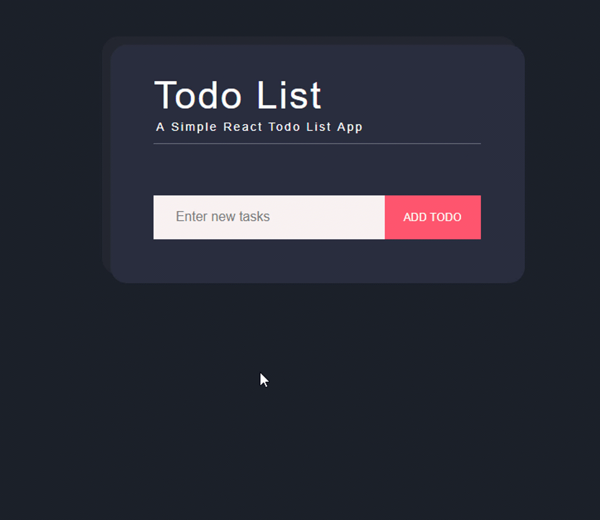

## To Do Applicaton
A functional, simple react app. This project served as a great exercise in understanding React concepts such as props, components, state changes and handling form submissions. I had a lot of fun creating this small project.
## Demo

You can edit, delete and even cross out based on your interactions as seen above.
